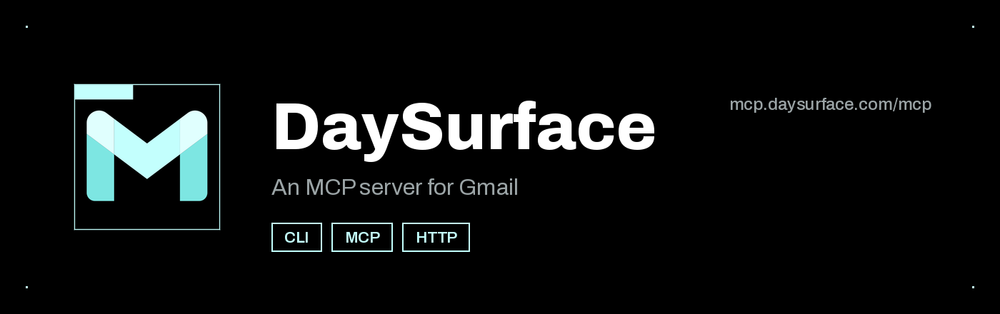
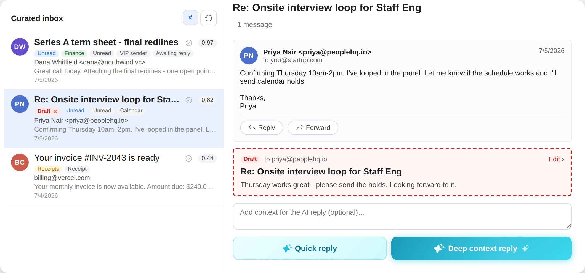
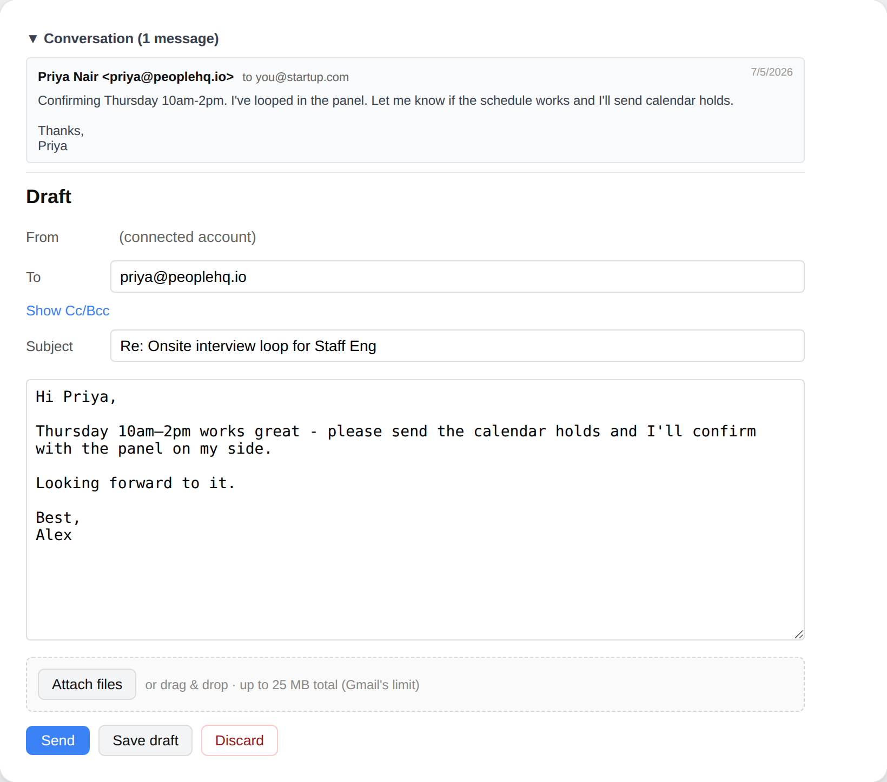
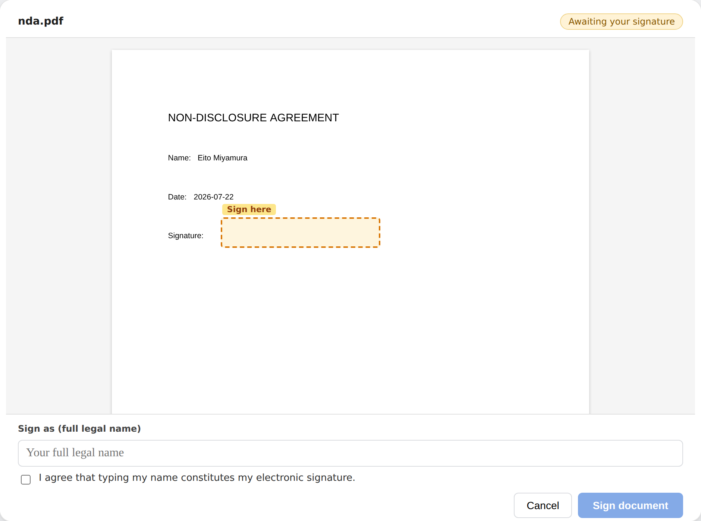
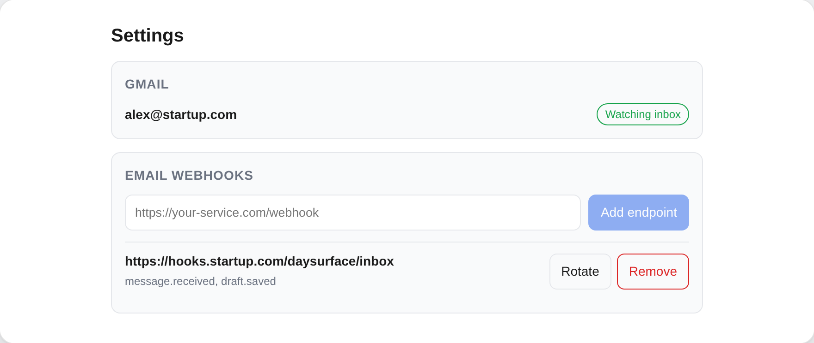

# DaySurface

<p align="center">
  
</p>

<p align="center">
<b>An MCP server for Gmail. One codebase ships as a CLI, an MCP server, and an HTTP API over a shared service registry.</b>
</p>

<p align="center">
  <a href="#mcp-ui">MCP UI</a> •
  <a href="#connect-your-client">Connect</a> •
  <a href="#architecture">Architecture</a> •
  <a href="#quick-start">Quick Start</a> •
  <a href="#cli-usage">CLI Usage</a> •
  <a href="#configuration">Configuration</a> •
  <a href="manual_docs/deploy.md">Deploy</a> •
  <a href="#credits">Credits</a>
</p>

<p align="center">
  <a href="https://railway.com/deploy/daysurface"></a>
  &nbsp;
  <a href="https://render.com/deploy?repo=https://github.com/Miyamura80/DaySurface"></a>
</p>

<p align="center">
  
  
  
  
  <a href="https://skills.sh/Miyamura80/DaySurface"></a>
</p>

---

## MCP UI

Four MCP Apps ship in the box. Each is a React bundle served as a `ui://` resource and rendered in the host's sandboxed iframe:

| | |
|:--|:--|
| **`gmail_inbox`** - curated inbox with importance scores and labels, beside a thread reader showing a pending draft and AI-drafted replies<br><br> | **`gmail_composer`** - draft editor with the conversation in context, attachments, and send / save / discard<br><br> |
| **`pdf_signer`** - pdf.js viewer with the signature field highlighted and a type-your-name signing ceremony<br><br> | **`settings`** - connected Gmail account, inbox watch state, and webhook endpoints with secret rotation<br><br> |

Screenshots are rendered from the committed app bundles by the fixture host in `mcp_server/dev_preview/` - no server, Gmail account, or OAuth involved. Reproduce any of them with `make preview_app APP=<name>`.

Apps are opt-in. Add an **enhancer** in `mcp_server/enhancers/` when a tool needs elicitation, image output, or an iframe dashboard. Enhancers wrap a service for the MCP transport only - the pure service stays untouched and CLI/API consumers are unaffected. See [`mcp_server/MCP_UI_ARCHITECTURE.md`](mcp_server/MCP_UI_ARCHITECTURE.md) for the full design.

## Connect Your Client

DaySurface is a remote MCP server, so there is nothing to install - point your client at the endpoint and sign in through the browser.

```text
Endpoint:   https://mcp.daysurface.com/mcp
Transport:  streamable HTTP (remote, not stdio)
Auth:       OAuth in the browser, no key to paste
```

| Client | Add it |
|:--|:--|
| <picture><source media="(prefers-color-scheme: dark)" srcset="media/clients/claude-dark.png"></picture> **Claude** | **[Add to Claude](https://claude.ai/new?modal=add-custom-connector&connectorName=DaySurface&connectorUrl=https%3A%2F%2Fmcp.daysurface.com%2Fmcp#settings/customize-connectors)** - opens the *Add custom connector* dialog with the name and URL filled in. Claude flags it as suggested by an external link; that is expected. On Team and Enterprise plans an admin adds it. |
| <picture><source media="(prefers-color-scheme: dark)" srcset="media/clients/chatgpt-dark.png"></picture> **ChatGPT** | Settings → Connectors → Advanced settings → turn on **Developer mode**. Back on Connectors, click **Create**, paste the endpoint, and name it. Start a new chat so the tools menu refreshes. |
| <picture><source media="(prefers-color-scheme: dark)" srcset="media/clients/cli-dark.png"></picture> **Claude Code** | `claude mcp add --transport http --scope user daysurface https://mcp.daysurface.com/mcp`<br>Then run `/mcp` in a session to sign in. |
| <picture><source media="(prefers-color-scheme: dark)" srcset="media/clients/cursor-dark.png"></picture> **Cursor** | [<picture><source media="(prefers-color-scheme: dark)" srcset="https://cursor.com/deeplink/mcp-install-light.svg"></picture>](https://cursor.com/en/install-mcp?name=daysurface&config=eyJ1cmwiOiJodHRwczovL21jcC5kYXlzdXJmYWNlLmNvbS9tY3AifQ%3D%3D)<br>Not working? Add the endpoint by hand under Settings → MCP. |
| <picture><source media="(prefers-color-scheme: dark)" srcset="media/clients/vscode-dark.png"></picture> **VS Code** | **[Add to VS Code](https://vscode.dev/redirect/mcp/install?name=daysurface&config=%7B%22type%22%3A%22http%22%2C%22url%22%3A%22https%3A%2F%2Fmcp.daysurface.com%2Fmcp%22%7D)** - requires Copilot agent mode. |
| <picture><source media="(prefers-color-scheme: dark)" srcset="media/clients/goose-dark.png"></picture> **Goose** | [](https://block.github.io/goose/extension?url=https%3A%2F%2Fmcp.daysurface.com%2Fmcp&type=streamable_http&id=daysurface&name=daysurface&description=daysurface+MCP+server&timeout=300)<br>Adds it as an extension over streamable HTTP. |
| <picture><source media="(prefers-color-scheme: dark)" srcset="media/clients/mcp-dark.png"></picture> **Any MCP client** | Add a remote server at `https://mcp.daysurface.com/mcp` over streamable HTTP. Cline, Zed and Windsurf all work - each spells the config differently (VS Code `servers`, Cursor and Cline `mcpServers`, Zed `context_servers`, and Windsurf wants `serverUrl` where everyone else wants `url`). |

Every one-click button routes through an `https://` install URL, since GitHub strips custom URL schemes such as `cursor://` from links. The same picker is on the [landing page](https://daysurface.com) - both are generated from `landing-page/src/config/landing/connect.ts`.

## Agent Prompt

> Copy and paste this into your AI coding agent (Claude Code, Cursor, Copilot, etc.) to install:

```text
Install the CLI and download the daysurface skill:

pip install daysurface

curl -fsSL https://raw.githubusercontent.com/Miyamura80/DaySurface/main/scripts/install-skills.sh -o install-skills.sh
bash install-skills.sh && rm install-skills.sh
```

The official **daysurface** agent skill is self-published on
[skills.sh](https://skills.sh/Miyamura80/DaySurface). Install it directly with:

```bash
npx skills add Miyamura80/DaySurface
```

The skill's source of truth lives in [`skills/daysurface/SKILL.md`](skills/daysurface/SKILL.md);
`make sync-skills` mirrors it to the landing page's
`/.well-known/agent-skills/` discovery tree (digest-pinned in `index.json`).

## Architecture

One codebase, three interfaces. Write business logic once in `services/` and it ships as a CLI subcommand, an MCP tool, and an HTTP route - same Pydantic input/output contract everywhere.

```
┌──────────────┐  ┌──────────────┐  ┌──────────────┐
│ src/cli/app  │  │ mcp_server/  │  │ api_server/  │   transport / interface
│  (Typer)     │  │ (FastMCP)    │  │ (FastAPI)    │
└──────┬───────┘  └──────┬───────┘  └──────┬───────┘
       │                 │                 │
       └─────────────────┼─────────────────┘
                         ▼
                 ┌───────────────┐
                 │  services/    │   pure @service functions
                 │  @service     │   (transport-agnostic)
                 └───────┬───────┘
                         ▼
                 ┌───────────────┐
                 │  models/      │   Pydantic I/O contracts
                 └───────┬───────┘
                         ▼
        ┌────────────┬───────┬────────────┬─────────────┐
        │ common/    │ db/   │ utils/llm/ │ src/utils/  │   shared infra
        │ (config)   │ (ORM) │ (DSPY)     │ (logs/theme)│
        └────────────┴───────┴────────────┴─────────────┘
```

## Quick Start

```bash
uv sync                     # install deps
uv run daysurface --help    # see all CLI commands
uv run daysurface doctor    # check your environment is wired up

uv run daysurface-serve   # start the server (HTTP API + MCP at /mcp on one port)
uv run daysurface-mcp     # legacy: stdio MCP only, for local Claude Desktop / dev
```

## Deploy

The buttons at the top of this page provision the backend and a managed Postgres, and run migrations on boot. See **[deployment docs](manual_docs/deploy.md)** for the per-platform setup, the Railway template variable map, and OAuth/secret wiring.

## CLI Usage

Global flags go **before** the subcommand:

| Flag | Short | Description |
|---|---|---|
| `--verbose` | `-v` | Increase output verbosity |
| `--quiet` | `-q` | Suppress non-essential output |
| `--debug` | | Show full tracebacks on error |
| `--format` | `-f` | Output format: `table`, `json`, `plain` |
| `--dry-run` | | Preview actions without executing |
| `--version` | `-V` | Print version and exit |

```bash
uv run daysurface --format json config show          # JSON output
uv run daysurface --verbose doctor                   # detailed output
uv run daysurface --dry-run secrets set OPENAI_API_KEY  # preview without writing
```

Commands are auto-discovered from `src/cli/commands/` - see [adding commands](manual_docs/adding_commands.md).

## Configuration

```python
from common import global_config

# Access config values from common/global_config.yaml
global_config.default_llm.default_model
global_config.llm_config.cache_enabled

# Access secrets from .env
global_config.OPENAI_API_KEY
```

CLI config inspection:

```bash
uv run daysurface config show                           # full config
uv run daysurface config get llm_config.cache_enabled   # single value
uv run daysurface config set logging.verbose false      # write override
```

[Full configuration docs](manual_docs/configuration.md)

## Credits

This software is built with:
- [uv](https://docs.astral.sh/uv/)
- [Typer: CLI framework](https://typer.tiangolo.com/)
- [Rich: Terminal formatting](https://rich.readthedocs.io/)
- [prek: Rust-based pre-commit framework](https://github.com/j178/prek)
- [DSPY: Pytorch for LLM Inference](https://dspy.ai/)
- [LangFuse: LLM Observability Tool](https://langfuse.com/)

## About the Core Contributors

<a href="https://github.com/Miyamura80/DaySurface/graphs/contributors">
  
</a>

Made with [contrib.rocks](https://contrib.rocks).
